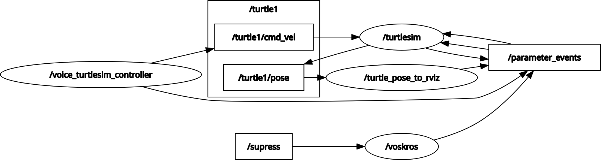
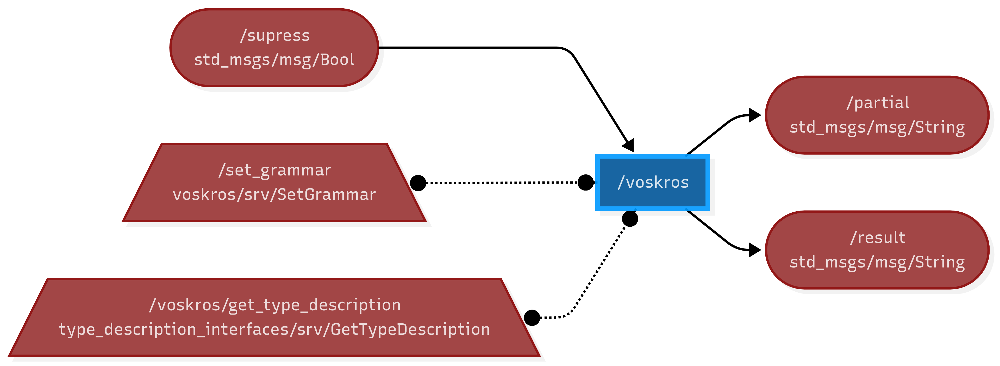
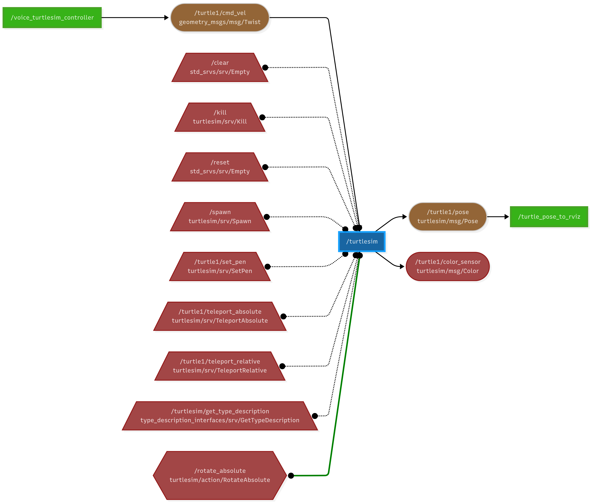
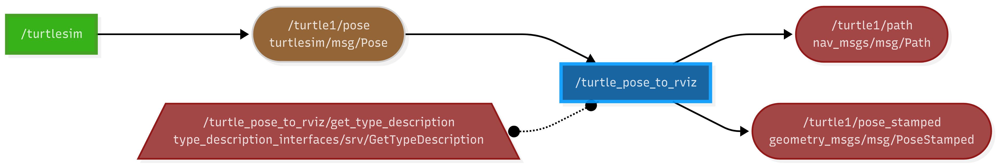

# Voice-Controlled Turtlesim Controller

<div align="center">
  <table>
    <tr>
      <td></td>
      <td></td>
      <td></td>
      <td></td>
    </tr>
  </table>
</div>

<div align="center"></div>

## Overview

This repository provides a ROS 2-based system for controlling the classic Turtlesim robot using natural voice commands. By integrating offline speech recognition (Vosk) with ROS 2 nodes, users can command the turtle to move, turn, and stop using simple spoken instructions. The system is modular, extensible, and suitable for robotics education, prototyping, and demonstrations of voice-driven robot control.



---

## Features

- **Voice Command Interface:** Control Turtlesim using phrases like "move forward", "turn left", "stop", etc.
- **Offline Speech Recognition:** Utilizes [Vosk](https://alphacephei.com/vosk/) for robust, privacy-friendly speech-to-text.
- **Real-Time Feedback:** Publishes command processing latency for performance monitoring.
- **ROS 2 Native:** Fully compatible with ROS 2 nodes, topics, and services.
- **Extensible:** Easily add new commands or integrate with other robots.

---

## Prerequisites

- **Operating System:** Linux (implemented on Ubuntu 24.04.2)
- **ROS 2:** Jazzy
- **Python 3.12.1+**
- **RVIZ2**
- **Audio Hardware:** Microphone

### ROS 2 Packages

- `turtlesim`
- `geometry_msgs`
- `std_msgs`
- `rclpy`, `rclcpp`

### Python Dependencies

Install these in your workspace or a virtual environment:

```bash
pip install SpeechRecognition PyAudio pyyaml lark
```

### Vosk Speech Recognition

Follow voskros/README.md for detailed setup. Basic steps:

```bash
pip install vosk sounddevice
sudo apt-get install libportaudio2 libasound-dev
```

---

## System Components

### Nodes

- **/voice_turtlesim_controller**  
  Python node that listens to the microphone, recognizes speech, and publishes velocity commands to `/turtle1/cmd_vel`.  
  Publishes latency to `/processing_latency`.
  

- **/voskros**  
  Provides offline speech-to-text, publishing recognized text to `/vosk/result`.
  

- **/turtlesim**  
  Standard Turtlesim node for robot simulation.
  

- **/turtle_pose_to_rviz**  
  (Optional but recommended) Publishes pose data for visualization.
  

### Topics

- `/turtle1/cmd_vel` (`geometry_msgs/msg/Twist`): Velocity commands for Turtlesim.
- `/processing_latency` (`std_msgs/msg/Float64`): Command processing latency.

- `/vosk/result` (`std_msgs/msg/String`): Recognized speech text.
- `/turtle1/pose` (`turtlesim/msg/Pose`): Turtle pose (for visualization).

### Services

- `/clear`, `/reset`, `/spawn`, `/kill`, `/turtle1/set_pen`, `/turtle1/teleport_absolute`, `/turtle1/teleport_relative`: Standard Turtlesim services.
- `/set_grammar`: Vosk grammar configuration (optional).

---

## Installation

### 1. Clone the Repository

```bash
cd ~/ros2_voice_ws/src
git clone https://github.com/yashmit178/ros2.git
```

### 2. Install Dependencies

```bash
# Python dependencies
pip install SpeechRecognition PyAudio vosk sounddevice

# System dependencies for audio
sudo apt-get install libportaudio2 libasound-dev
```

### 3. Build the Workspace

```bash
cd ~/ros2_voice_ws
colcon build
source install/setup.bash
```

### 4. Run the System

In separate terminals:

```bash
# 1. Start Turtlesim
source /opt/ros/jazzy/setup.bash
cd ~/ros2_voice_ws
source .venv/bin/activate
source install/setup.bash
ros2 run turtlesim turtlesim_node

# 2. Start Vosk speech recognition node
source /opt/ros/jazzy/setup.bash
cd ~/ros2_voice_ws
source .venv/bin/activate
source install/setup.bash
ros2 run voskros vosk

# 3. Start the voice command controller
source /opt/ros/jazzy/setup.bash
cd ~/ros2_voice_ws
source .venv/bin/activate
source install/setup.bash
export PYTHONPATH="${VIRTUAL_ENV}/lib/python3.12/site-packages:${PYTHONPATH}" && source /opt/ros/jazzy/setup.bash && source install/setup.bash && ros2 run voice_turtlesim_controller voice_command_node

# 4. Start the RViz simulation node, Add pose and path in RViz
source /opt/ros/jazzy/setup.bash
cd ~/ros2_voice_ws
source .venv/bin/activate
source install/setup.bash
ros2 run voice_turtlesim_controller turtle_pose_to_rviz

```

---

## Usage

Speak commands such as:

- "move forward"
- "move fast"
- "turn left"
- "turn right"
- "turn around"
- "stop"

The turtle will respond accordingly. Processing latency is published on `/processing_latency` for monitoring.

---

## System Diagram

See voicetsimconChart.png and vtsimcon.md for a detailed architecture.

---

## References

- [Vosk Speech Recognition](https://github.com/bob-ros2/voskros)
- [ROS 2 Documentation](https://docs.ros.org/en/jazzy/index.html)
- [Turtlesim,rqt](https://docs.ros.org/en/jazzy/Tutorials/Beginner-CLI-Tools/Introducing-Turtlesim/Introducing-Turtlesim.html)
- [RVIZ](https://docs.ros.org/en/jazzy/Tutorials/Intermediate/RViz/RViz-User-Guide/RViz-User-Guide.html)