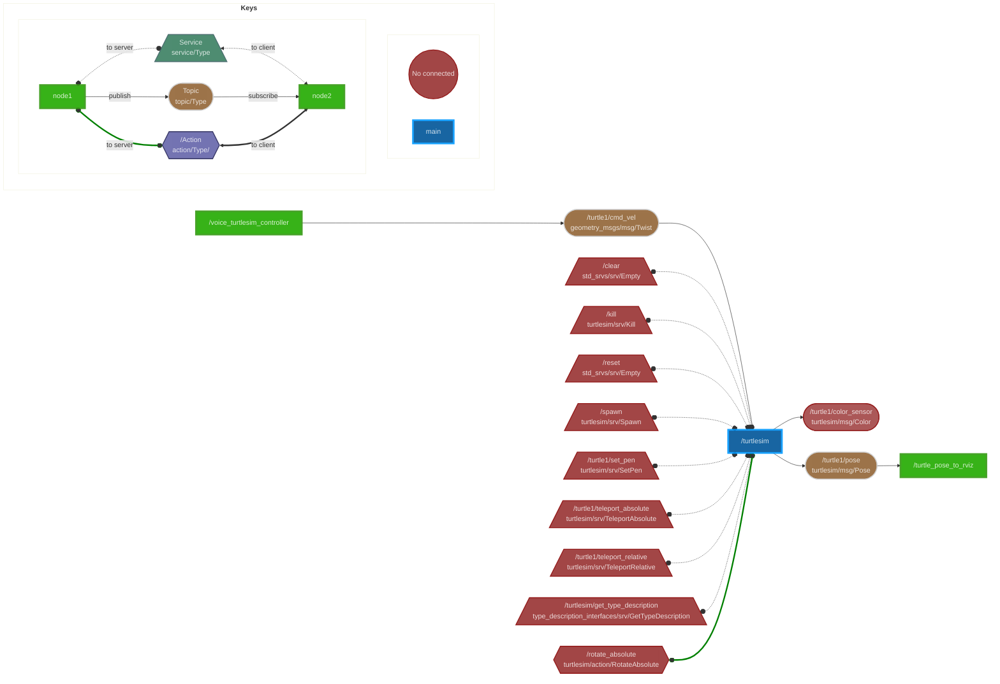

```mermaid
flowchart LR

/turtlesim[ /turtlesim ]:::main
/voice_turtlesim_controller[ /voice_turtlesim_controller ]:::node
/turtle_pose_to_rviz[ /turtle_pose_to_rviz ]:::node
/turtle1/cmd_vel([ /turtle1/cmd_vel<br>geometry_msgs/msg/Twist ]):::topic
/turtle1/color_sensor([ /turtle1/color_sensor<br>turtlesim/msg/Color ]):::bugged
/turtle1/pose([ /turtle1/pose<br>turtlesim/msg/Pose ]):::topic
/clear[/ /clear<br>std_srvs/srv/Empty \]:::bugged
/kill[/ /kill<br>turtlesim/srv/Kill \]:::bugged
/reset[/ /reset<br>std_srvs/srv/Empty \]:::bugged
/spawn[/ /spawn<br>turtlesim/srv/Spawn \]:::bugged
/turtle1/set_pen[/ /turtle1/set_pen<br>turtlesim/srv/SetPen \]:::bugged
/turtle1/teleport_absolute[/ /turtle1/teleport_absolute<br>turtlesim/srv/TeleportAbsolute \]:::bugged
/turtle1/teleport_relative[/ /turtle1/teleport_relative<br>turtlesim/srv/TeleportRelative \]:::bugged
/turtlesim/get_type_description[/ /turtlesim/get_type_description<br>type_description_interfaces/srv/GetTypeDescription \]:::bugged
/rotate_absolute{{ /rotate_absolute<br>turtlesim/action/RotateAbsolute }}:::bugged
/turtle1/cmd_vel --> /turtlesim
/turtle1/pose --> /turtle_pose_to_rviz
/turtlesim --> /turtle1/color_sensor
/turtlesim --> /turtle1/pose
/voice_turtlesim_controller --> /turtle1/cmd_vel
/clear o-.-o /turtlesim
/kill o-.-o /turtlesim
/reset o-.-o /turtlesim
/spawn o-.-o /turtlesim
/turtle1/set_pen o-.-o /turtlesim
/turtle1/teleport_absolute o-.-o /turtlesim
/turtle1/teleport_relative o-.-o /turtlesim
/turtlesim/get_type_description o-.-o /turtlesim

/rotate_absolute o==o /turtlesim

subgraph keys[<b>Keys<b/>]
subgraph nodes[<b><b/>]
topicb((No connected)):::bugged
main_node[main]:::main
end
subgraph connection[<b><b/>]
node1[node1]:::node
node2[node2]:::node
node1 o-.-o|to server| service[/Service<br>service/Type\]:::service
service <-.->|to client| node2
node1 -->|publish| topic([Topic<br>topic/Type]):::topic
topic -->|subscribe| node2
node1 o==o|to server| action{{/Action<br>action/Type/}}:::action
action <==>|to client| node2
end
end
classDef node opacity:0.9,fill:#2A0,stroke:#391,stroke-width:4px,color:#fff
classDef action opacity:0.9,fill:#66A,stroke:#225,stroke-width:2px,color:#fff
classDef service opacity:0.9,fill:#3B8062,stroke:#3B6062,stroke-width:2px,color:#fff
classDef topic opacity:0.9,fill:#852,stroke:#CCC,stroke-width:2px,color:#fff
classDef main opacity:0.9,fill:#059,stroke:#09F,stroke-width:4px,color:#fff
classDef bugged opacity:0.9,fill:#933,stroke:#800,stroke-width:2px,color:#fff
style keys opacity:0.15,fill:#FFF
style nodes opacity:0.15,fill:#FFF
style connection opacity:0.15,fill:#FFF
linkStyle 13,18 fill:none,stroke:green;
```

