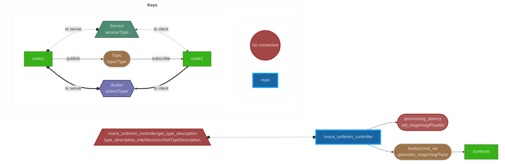

```mermaid
flowchart LR

/voice_turtlesim_controller[ /voice_turtlesim_controller ]:::main
/turtlesim[ /turtlesim ]:::node
/processing_latency([ /processing_latency<br>std_msgs/msg/Float64 ]):::bugged
/turtle1/cmd_vel([ /turtle1/cmd_vel<br>geometry_msgs/msg/Twist ]):::topic
/voice_turtlesim_controller/get_type_description[/ /voice_turtlesim_controller/get_type_description<br>type_description_interfaces/srv/GetTypeDescription \]:::bugged

/turtle1/cmd_vel --> /turtlesim
/voice_turtlesim_controller --> /processing_latency
/voice_turtlesim_controller --> /turtle1/cmd_vel
/voice_turtlesim_controller/get_type_description o-.-o /voice_turtlesim_controller


subgraph keys[<b>Keys<b/>]
subgraph nodes[<b><b/>]
topicb((No connected)):::bugged
main_node[main]:::main
end
subgraph connection[<b><b/>]
node1[node1]:::node
node2[node2]:::node
node1 o-.-o|to server| service[/Service<br>service/Type\]:::service
service <-.->|to client| node2
node1 -->|publish| topic([Topic<br>topic/Type]):::topic
topic -->|subscribe| node2
node1 o==o|to server| action{{/Action<br>action/Type/}}:::action
action <==>|to client| node2
end
end
classDef node opacity:0.9,fill:#2A0,stroke:#391,stroke-width:4px,color:#fff
classDef action opacity:0.9,fill:#66A,stroke:#225,stroke-width:2px,color:#fff
classDef service opacity:0.9,fill:#3B8062,stroke:#3B6062,stroke-width:2px,color:#fff
classDef topic opacity:0.9,fill:#852,stroke:#CCC,stroke-width:2px,color:#fff
classDef main opacity:0.9,fill:#059,stroke:#09F,stroke-width:4px,color:#fff
classDef bugged opacity:0.9,fill:#933,stroke:#800,stroke-width:2px,color:#fff
style keys opacity:0.15,fill:#FFF
style nodes opacity:0.15,fill:#FFF
style connection opacity:0.15,fill:#FFF

```

